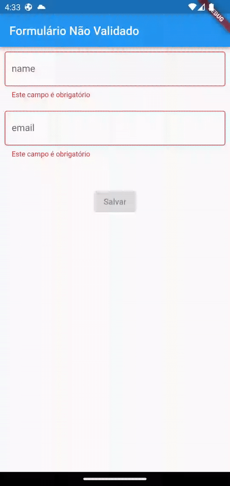

# mobx_flutter

Projeto em Flutter criado com o objetivo de entender o gerenciamento de estados utilizando o Package [MobX](https://pub.dev/packages/mobx)

A aplicação consiste em um formulário que possui os campos de nome e e-mail e é validado dinamicamente com a utilização do MobX. Como rotineiramente faço apenas a utilização do Provider, decidi estudar um pouco mais sobre outras ferramentas de gerenciamento de estados e o MobX foi a que decidi estudar para expandir os conhecimentos no framework Flutter.

    

